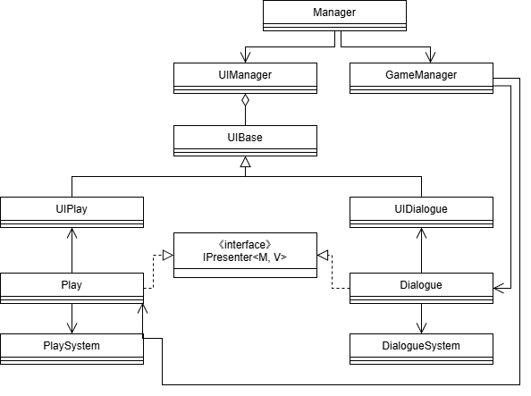

# Portfolio - Park Minhee
>   
Unity 6.0 환경에서 작업한 프로젝트의 소스코드 일부 발췌

 

# 프로젝트 구조
간단한 메모리 게임과 게임 플레이 방법을 대화로 안내해주는 다이얼로그 시스템 구현
  

 

# 작동 예시
|다이얼로그|게임 플레이|
|---|---|
|||
 

# Base
스크립트의 역할 별 공통 사항을 정의

>### UIBase
>- 각 UI 패널에 해당하는 스크립트가 상속받을 Base
>- `UIManager`에서 초기화 및 통합 관리
  
>### IPresenter<M, V>
>- `M` : 기능 구현에 필요한 비즈니스 로직이 포함된 System 클래스
>- `V` : `UIBase`를 상속받은 UI 클래스
>- `M` ↔ `V` 이벤트 바인딩을 담당하는 Presenter 역할
>- `GameManager`에서 초기화 및 통합 관리
  
 

# Utils
반복 사용이 잦은 함수 및 범용적으로 사용 가능한 기능 취합

>### BindUtils
>- `ActionEx` : Action 이벤트 바인딩 함수
>- `UI.ButtonEx` : Unity UI Button의 이벤트 바인딩 함수
  
>### DataUtils
>- `CSVParser` : CSV 유형의 데이터 파싱 함수
>- `TreeNode<T>` : 재귀 구조의 데이터 집합 구성을 위한 클래스 구조
 
